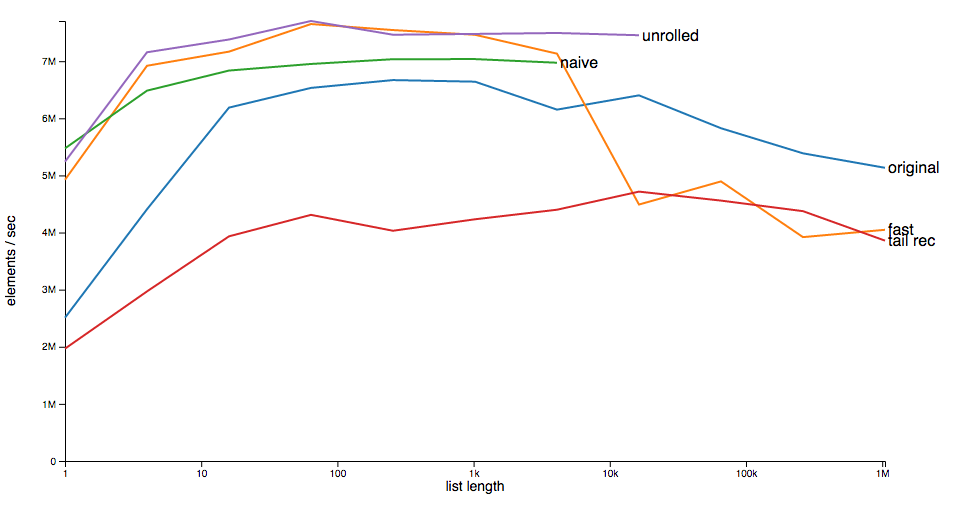

# elm-core-benchmark
Benchmarking suites for core Elm functions

Test performance of a new implementation of `List.map`. The objective is to
build a pure-Elm version of map that has good performance for shorter lists and
avoids stack overflow for long lists.  See
[Help improve the List library](https://groups.google.com/forum/#!msg/elm-dev/He_emRjsly8/UgeRD85TAwAJ)
on the elm-dev list.

This runs timing benchmarks over five different implementations of a map function over `List Int` values.

* "original" is List.map in elm-lang/core.

* "naive" is the simple obvious version without tail-recursion.

* "unrolled" is the naive version, unrolled to handle four elements at a time.

* "tail rec" is a tail-recursive version.

* "fast" (optimistically named) blends "unrolled" with "tail rec". It uses the
  unrolled logic up to 4000 elements, then switches over to tail-recursive logic
  for the remainder.

The "naive" and "unrolled" versions perform well but are not tail-recursive and
so grow the stack as the list length increases, eventually leading to stack
overflow.

The "tail-recursive" version is slower as it has to reverse the list after
mapping it, but Elm optimizes for the tail recursion and so this one does not
overflow the stack even for very large lists.

Each benchmark suite here runs all five implementations against the same list of
a fixed size. We generate such suites for a range of sizes from 1 up to 2^20
(1,048,576).



In the chart we can see how the "fast" version (orange line) tracks the unrolled version for smaller lists, then switches at around 4000 elements to track the performance of the tail-recursive version (red line).

## Installation

This application depends on https://github.com/fredcy/elm-benchmark for the `Benchmark` module.

```shell
git clone https://github.com/fredcy/elm-core-benchmark.git
cd elm-core-benchmark
make vendor/benchmark
make
open bench.html
```
